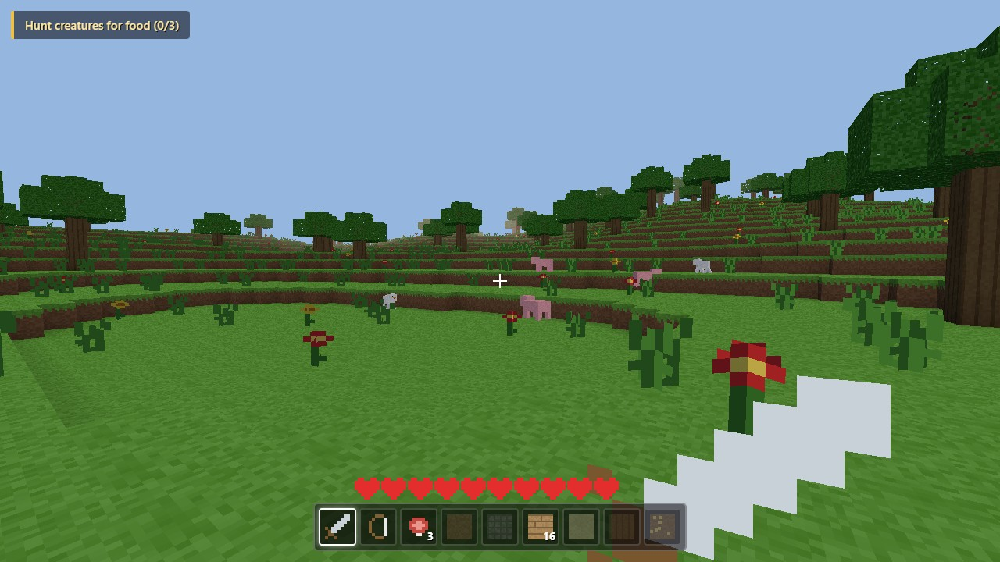
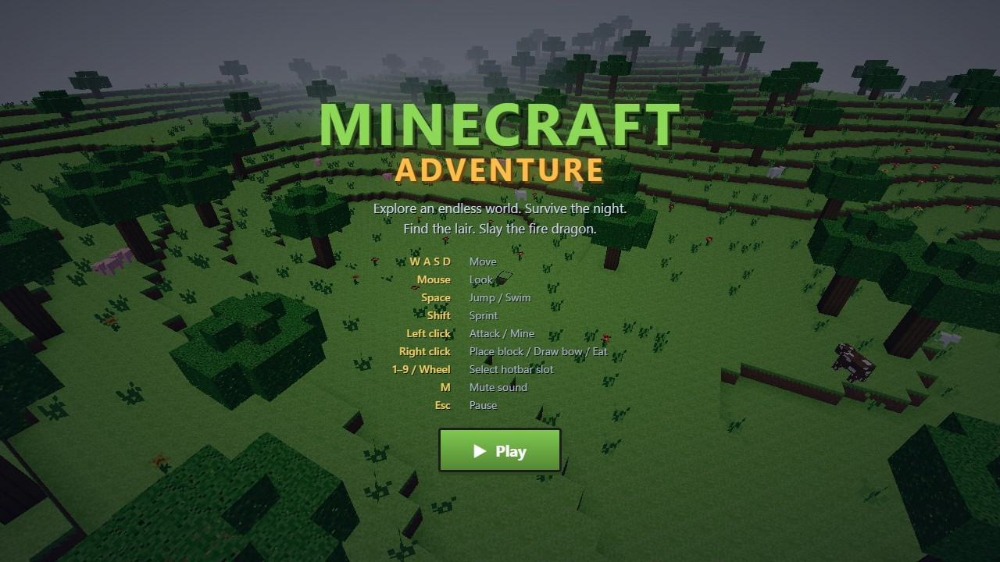
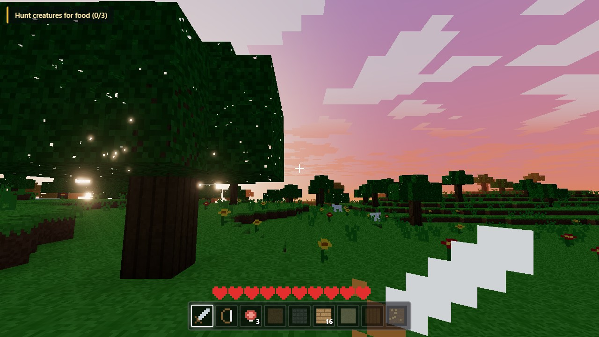
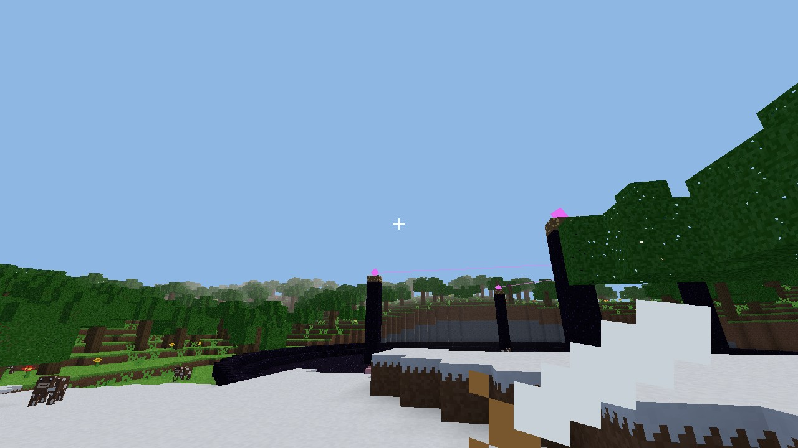
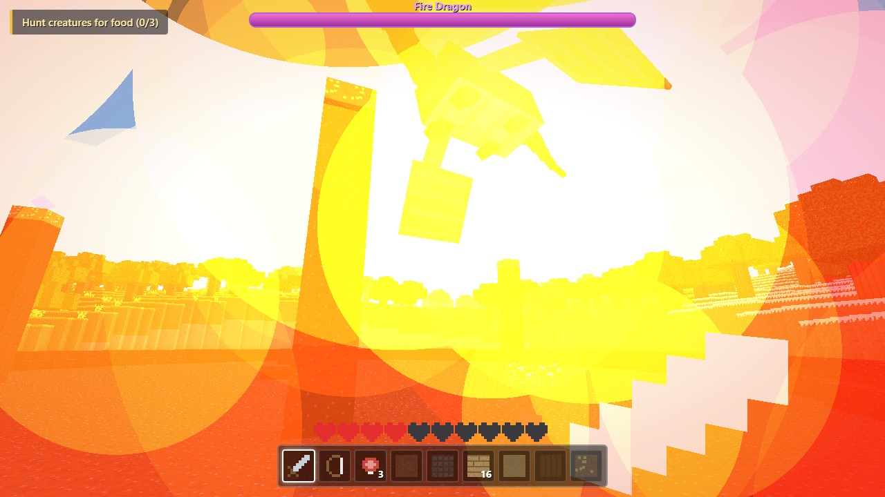

# Minecraft Adventure

A Minecraft-inspired voxel adventure that runs entirely in the browser. Explore an infinite procedurally generated world, survive the night, hunt for food, find the obsidian lair — and slay the fire-breathing dragon that guards it.

Built with **TypeScript + Three.js + Vite**. Every texture is drawn procedurally on a canvas atlas and every sound is synthesized with WebAudio — the game ships **zero external assets**.



## Features

- **Infinite voxel world** — seeded terrain streamed in 16×96×16 chunks around the player, with plains, forest, desert and snow biomes, trees, lakes, flowers and tall grass.
- **Fully destructible — and persistent** — mine and place blocks with a 9-slot hotbar, DDA raycast targeting, per-block break times and progressive crack overlays. Your edits survive walking away *and* page reloads (saved per world seed).
- **Filmic rendering** — ACES tone mapping with an HDR bloom pass: the sun flares through the trees, flames and explosions glow, crystal beams light up the night.
- **Living atmosphere** — a shader sky dome with sunrise/sunset glow, drifting blocky clouds, twinkling stars, wind-swaying grass and leaves, rippling water, fireflies after dark and falling leaves in the forest.
- **Living creatures** — pigs, cows, sheep and chickens wander and flee; zombies and skeletons rise at night and burn at dawn.
- **Combat & survival** — sword melee, chargeable bow with arced arrows, hearts, fall damage, food healing and passive regen — plus camera shake on hits, a sprint FOV kick and per-surface footsteps.
- **The Dragon** 🐉 — an articulated boss with flapping wings, banking flight, swoop attacks, explosive fireballs and a flame-breath strafing run that leaves burning ground behind. Four healing crystals shield it — destroy them first.
- **Adventure quest chain** — hunt → find the lair (with compass) → destroy the crystals → slay the dragon → victory, all framed by a live world panorama on the title screen.
- **Procedural everything** — texture atlas painted at startup, sound effects synthesized live, no downloads.

| | |
|---|---|
|  |  |
|  |  |

## Controls

| Input | Action |
|---|---|
| `W A S D` | Move |
| Mouse | Look |
| `Space` | Jump / swim |
| `Shift` | Sprint |
| Left click | Attack / mine |
| Right click | Place block / draw bow / eat |
| `1–9` / wheel | Select hotbar slot |
| `M` | Mute sound |
| `Esc` | Pause |

## Getting Started

```bash
npm install
npm run dev        # http://localhost:5173
```

Production build and preview:

```bash
npm run build      # typecheck (tsc strict) + vite build → dist/
npm run preview
```

Tests and lint:

```bash
npm test           # vitest unit suite (noise, physics, quests, edit store)
npm run lint       # oxlint, warnings are errors
```

### Docker

```bash
docker compose up --build   # serves the game on http://localhost:8080
```

The image is a multi-stage build: Node builds the bundle, then an unprivileged nginx serves the static files with a healthcheck.

## How to Win

1. **Hunt 3 creatures** — collect the meat they drop; eat it later to heal.
2. **Follow the compass** in the quest banner to the obsidian lair (~350m from spawn).
3. **Destroy the 4 crystals** on the towers — while they live, they heal the dragon and halve your damage. The bow works well here.
4. **Slay the dragon.** Watch for the swoop, dodge the fireballs, and never stand in the fire.

## Architecture

```
src/
├── core/        game loop, input, state machine, math utils
├── world/       noise, chunks, terrain generator, mesher, streaming, atlas, lair
├── player/      controller, voxel physics, block interaction, inventory, viewmodel
├── entities/    mob framework, animals, monsters, spawner, dragon model + AI, crystals
├── combat/      projectiles, melee/bow/food, fire zones
├── effects/     sky (day/night), pooled particles
├── adventure/   quest chain
├── ui/          HUD, screens
└── audio/       synthesized sound effects
```

Key techniques: face-culled chunk meshing with per-vertex ambient occlusion, Amanatides–Woo voxel raycasting, axis-separated AABB physics shared by the player and every mob, an ACES + HDR-bloom post pipeline, vertex-shader wind injected into the chunk materials, a per-chunk edit diff persisted to localStorage, a ring-buffer particle pool (one draw call per blend mode), and a hierarchical box-model dragon rig animated procedurally.

More docs: [architecture](docs/system-architecture.md) · [codebase summary](docs/codebase-summary.md) · [code standards](docs/code-standards.md) · [deployment guide](docs/deployment-guide.md) · [roadmap](docs/project-roadmap.md) · [decision records](docs/adr/) · [changelog](CHANGELOG.md) · [contributing](CONTRIBUTING.md)

## License

MIT © Nguyen Tien Son
